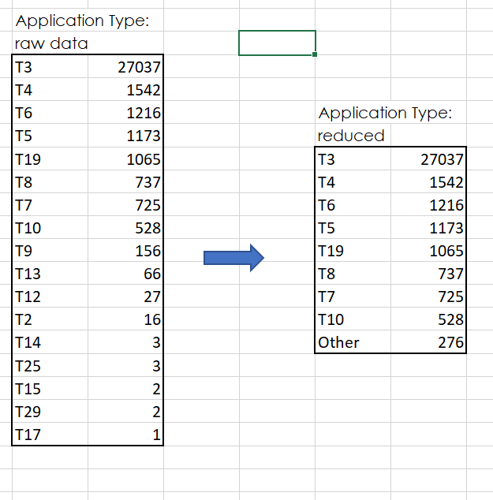
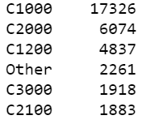
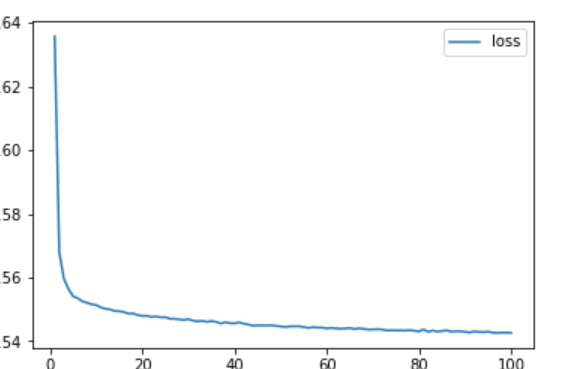

# Neural_Network_Charity_Analysis
Module 19
## Overview
AlphabetSoup Charities has been making grants to organizations. Interersted organizations have submitted grant requests and project proposals, and we have been evaluating each of these based on our evaluation of the goals of the project and our evaluation of the ability of the organization to achieve those goals. We have also considered the reputation of the organization, the geography (are we helping the areas where our parent organization does business), and any other number of intangibles.

I am attempting to see if any combination of observable, quantifiable factors can give us further insights into what projects have succeeded, and whether this can give us any insights as we consider future requests. For this effort, I am using the tensorflow implementation of a neural networking paradigm; this will allow me to look ofr patterns evenwithout understanding the raw data fully, or having a prior intuition of how each element should impact the results. (see the *Limitations* section later in this documentation)

## Results
### Preprocessing (targets, variables, removed)

The raw data included features that needed to be pre-processed before being used in the analysis.

First, I dropped the EIN and NAME columns; they are unique to each project and shouldn't add any predictive value.

I used:

- Application type (compressed)
- Affiliation
- Classification (compressed)
- Use case
- Organization 
- Status
- Income amount
- Special considerations
- Ask amount

As noted, the application type and classification data was compressed somewhat. This allows for somewhat faster processing, and probably won't reduce the value of the analysis much as only the smaller groups (by number of instances) are grouped together.

Reduction of Application Types:

Classifications Modeled:

Tried to match IS_SUCCESSFUL - existing indicator of success for each project.

### Compiling, Training and Evaluating
#### Initial Calibration

For this exercise,I used the binary_crossentropy loss model, which is generally appropriate when looking for a yes/no answer, and tried to maximize accurary.

Most of the data was used in calibrating the model, but a subset was excluded from the calibration and used in testing the resulting model fit.

For the first attempt at modeling the success rate indicators, I chose a deep-learning network consisting of 2 hidden layers, with 10 and 5 nodes respectively. Fitting this model and applying against the testing data resulted in accuracy of 72.8.

#### Optimization

A 73% accumracy rate couldbe interesting, but hardly compeling. 

I tried three approaches to try and improve on that.

For the first refinement, I increased the number of nodes in the first hidden layer to 80. This backfired, and reduced the accuracy a little bit to 72.4

My next approach: inrease the number of epochs (iteration) of the model. This produced a rather modest improvement, showing an accuracy of 73.4% against the test. Looking at the accuracy against the training data by epoch:

My final attempt: add another hidden layer. This brought accuracy back down to the initial level.

## Summary
I was only able to produce accuracy in the mid 70's. This might help give a bit of insight into the data, but should not be enough to change our grant procedures.

For further study: 

- can a more simple approach, such as logistic regression, give us more insight? Even if the accuracy is no better in aggregate, this approach could give us better visibility into which input factors are more tightly correlated with success. 

## Disclosures

All these grants were made after a review of factors that cannot be easily encapsulated into the input data; ie. we have no metrix for the passion and inventiveness of an organizations board and volunteers. Even if we had found a model with a better fit, this would not replace our current grant process - at best, it would add some insight, and maybe let us focus on some of the challenges that emerge by grant feature.